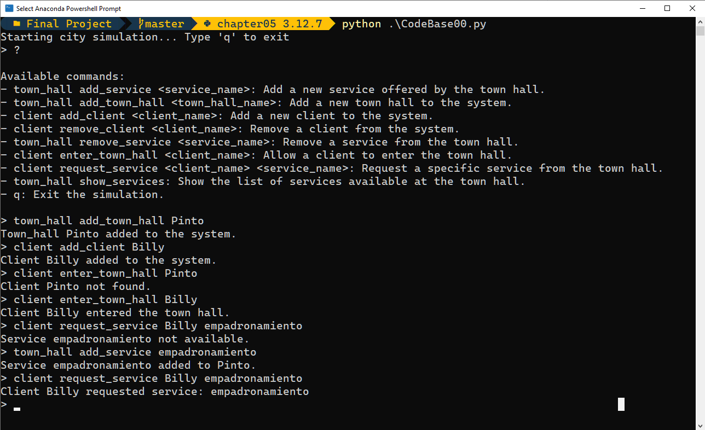

# 7. **Clientes y Ayuntamiento**

**Funcionalidad:** Gestión de servicios ofrecidos por el ayuntamiento y las interacciones de los ciudadanos (clientes) con él. Permite agregar y eliminar servicios y ayuntamientos, así como gestionar la entrada de clientes al ayuntamiento y la solicitud de servicios específicos. Esta funcionalidad estará pre-establecida en el código base que será el punto de partida para desarrollar el simulador por cada grupo.

## Comandos utilizados

1. **town_hall add_service <service_name>**: Add a new service offered by the town hall.
- **town_hall add_town_hall <town_hall_name>**: Add a new town hall to the system.
- **client add_client <client_name>**: Add a new client to the system.
- **client remove_client <client_name>**: Remove a client from the system.
- **town_hall remove_service <service_name>**: Remove a service from the town hall.
- **client enter_town_hall <client_name>**: Allow a client to enter the town hall.
- **client request_service <client_name> <service_name>**: Request a specific service from the town hall.
- **town_hall show_services**: Show the list of services available at the town hall.

## Programa en ejecución

