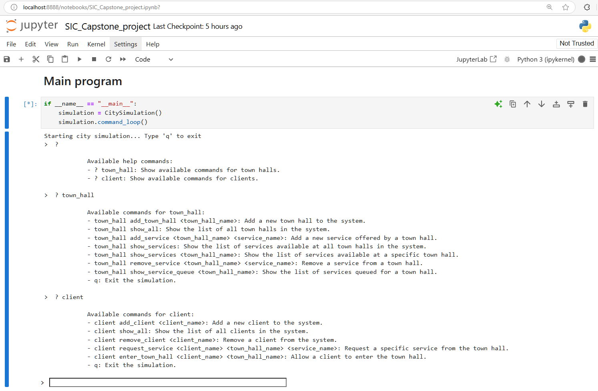

# 7. **Clientes y Ayuntamiento**

**Funcionalidad:** Gestión de servicios ofrecidos por el ayuntamiento y las interacciones de los ciudadanos (clientes) con él. Permite agregar y eliminar servicios y ayuntamientos, así como gestionar la entrada de clientes al ayuntamiento y la solicitud de servicios específicos. Esta funcionalidad estará pre-establecida en el código base que será el punto de partida para desarrollar el simulador por cada grupo.

## Comandos utilizados

**Available commands for town_hall:**

- **town_hall add_town_hall <town_hall_name>**: Add a new town hall to the system.
     all show_all: Show the list of all town halls in the sytem
- **town_hall add_service <town_hall_name> <service_name>**: Add a new service offered by one town hall.
     all show_services: Show the list of services available at all town hall in the system
- **town_hall show_services <town_hall_name>** : Show the list of services available at all town hall in the system
     all remove_service <town_hall_name> <service_name>: Remove a service from one town hall.
- **town_hall show_services_queue <town_hall_name>**: all show_services_queue <town_hall_name>

**Available commands for client:**  

- **client add_client <client_name>**: Add a new client to the system.
-  **show_all**: Show list of all clients in the system              
- **client remove_client <client_name>**: Remove a client from the system.
- **request_service <client_name> <town_hall_name> <service_name>**: Request a specific service from the town hall.
- **client enter_town_hall <client_name> <town_hall_name>**: Allow a client to enter the town hall.
- **exit_town_hall <client_name> <town_hall_name>**: Allow a client to exit the specified town hall.

**q**: Exit the simulation.

**Automático:** ***process_request_service()***: Method processes client service requests from the town hall's queue, checks if the time threshold has been met, and notifies the client once their request is fulfilled.

## Programa en ejecución

