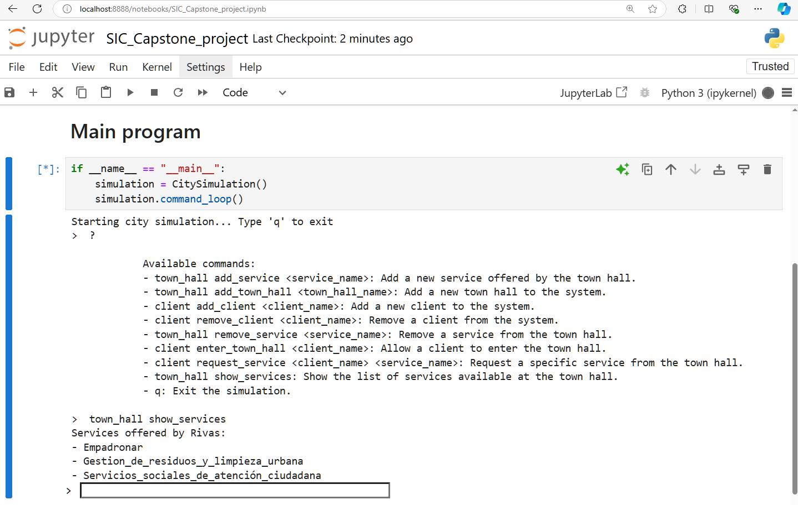

# 8. **Clientes y Hospitales**

**Funcionalidad:** Gestión de la interacción entre los clientes (personas) y los hospitales. Permite agregar y eliminar hospitales, gestionar citas médicas, solicitudes de atención de urgencias y la asignación de médicos. Esta funcionalidad estará pre-establecida en el código base que será el punto de partida para desarrollar el simulador por cada grupo.

## Comandos utilizados

**Available commands for hospital:**

- **hospital add_hospital <hospital_name>**: Add a new hospital to the system.
- **hospital show_all**: Show the list of all hospitals in the system.
- **hospital add_doctor <hospital_name> <doctor_name>**: Add a new doctor to a specific hospital.
- **hospital assign_doctor <hospital_name> <doctor_name>**: Assign a doctor to a hospital.
- **hospital list_doctors <hospital_name>**: List all doctors available in the specified hospital.
- **hospital show_urgent_queue <hospital_name>**: Show the list of clients in the urgent care queue at a hospital.
- **hospital show_appointments <hospital_name>**: Show all scheduled appointments for a hospital.
- **hospital cancel_appointment <client_name> <hospital_name>**: Cancel a client's appointment at a hospital.

**Available commands for client:**

- **client add_client <client_name>**: Add a new client to the system.
- **client show_all**: Show list of all clients in the system.
- **client remove_client <client_name>**: Remove a client from the system.
- **client request_appointment <client_name> <hospital_name>**: Request an appointment at a specific hospital.
- **client request_urgent_care <client_name> <hospital_name>**: Request urgent care at a specific hospital.
- **client check_appointment_status <client_name>**: Check the status of the client's appointment.
- **client enter_hospital <client_name> <hospital_name>**: Allow a client to enter the hospital.
- **client exit_hospital <client_name> <hospital_name>**: Allow a client to exit the specified hospital.

**q**: Exit the simulation.

**Automatic:** ***process_appointment_request()***: Method processes client appointment requests, assigns a doctor if available, and notifies the client once their appointment is scheduled.

***process_urgent_care()***: Method processes urgent care requests, prioritizes clients based on urgency, and notifies the client once they are attended to.Programa en ejecución

