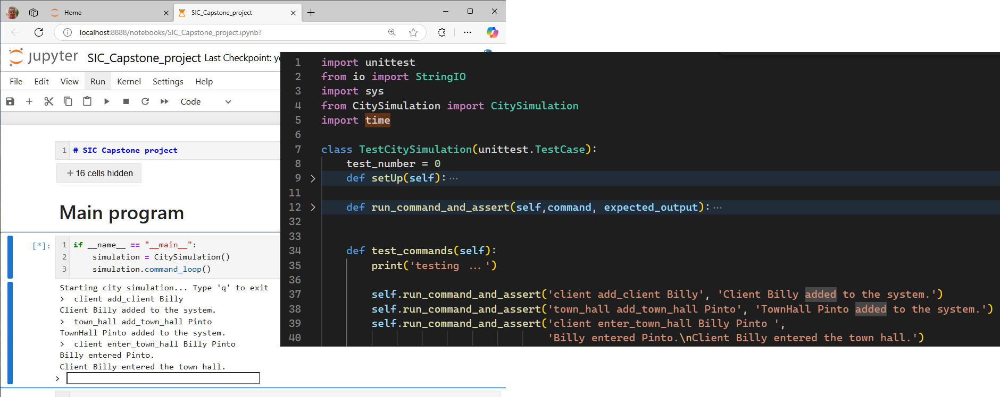

# Testing Capstone Projects

## 1. Convert Jupyter notebook to tested file.

```powershell
jupyter nbconvert --to script <jupyter_notebook_file_name>.ipynb --output CitySimulation
```

## 2. Prepare the test cases

**Include the commands from the simulation project in test cases:**

**Each command used in the simulation must have a corresponding test case**

- **Commands**
  - **client add_client <client_name>**: Add a new client to the system.
  - **client show_all**: Show the list of all clients in the system.
  - **client remove_client <client_name>**: Remove a client from the system.
  - **client request_service <client_name> <town_hall_name> <service_name>**: Request a specific service from the town hall.
  - **client enter_town_hall <client_name> <town_hall_name>**: Allow a client to enter the town hall.
  - **And other commands from your simulator.**

**Each execution of the command will become the test input, and the command output will serve as the expected test output.**

```bash
Starting city simulation... Type 'q' to exit
>  client add_client Billy
Client Billy added to the system.
>  town_hall add_town_hall Pinto
TownHall Pinto added to the system.
>  client enter_town_hall Billy Pinto
Billy entered Pinto.
Client Billy entered the town hall.
```

**Update the `test_commands` method with each command from your simulator and its output.**

This file is here:[test_city_simulation.py](test/test_city_simulation.py)

```python
def test_commands(self):
    print('testing ...')

    self.run_command_and_assert('client add_client Billy', 'Client Billy added to the system.')
    self.run_command_and_assert('town_hall add_town_hall Pinto', 'TownHall Pinto added to the system.')
    self.run_command_and_assert('client enter_town_hall Billy Pinto ', 
                                'Billy entered Pinto\nClient Billy entered the town hall.')
```


The result must be included by updating the `test_citysimulation.py` file in the `test_commands()` method for each project related to the town hall project.



## 3. Run the test cases

Open an **Anaconda PowerShell terminal**, activate your *environment*, and execute the following command in the folder where the **Jupyter** **notebook** and the files for the previous test steps are located.

```powershell
python -m unittest test_city_simulation.py
```

The result of execution is:
```bash
testing ...
# 1
>client add_client Billy
Client Billy added to the system. "Test passsed!"
# 2
>town_hall add_town_hall Pinto
TownHall Pinto added to the system. "Test passsed!"
# 3
>client enter_town_hall Billy Pinto
Billy entered Pinto.
Client Billy entered the town hall. "Test passsed!"
# 4
>town_hall show_all
Current TownHall(s):
Pinto "Test passsed!"
# 5
>town_hall add_service Pinto Empadronar
Service Empadronar added to Pinto. "Test passsed!"
# 6
>town_hall show_services
Services offered by Pinto:
- Empadronar "Test passsed!"
# 7
>town_hall show_services Pinto
Services offered by Pinto:
- Empadronar "Test passsed!"
# 8
>client request_service Billy Pinto Empadronar
Client Billy requested service: Empadronar "Test passsed!"
# 9
>town_hall show_service_queue Pinto
Services in queue for town hall 'Pinto':
Client: Billy, Service: Empadronar, Timestamp: 1730050482.35 "Test passsed!"
# 10
>town_hall remove_service Pinto Empadronar
Service Empadronar removed from Pinto. "Test passsed!"
# 11
>client show_all
Current Client(s):
Billy "Test passsed!"
# 12
>client remove_client Billy
Agent Billy removed from the system. "Test passsed!"
.
----------------------------------------------------------------------
Ran 1 test in 0.038s

OK
```

## 4. Capstone functionality grading.

Each result from the execution of the test cases will evaluate its corresponding command from the simulator, along with its correct (**Test passed!**) or incorrect (**Test not passed!**) acceptance for the capstone submission and its final score.
